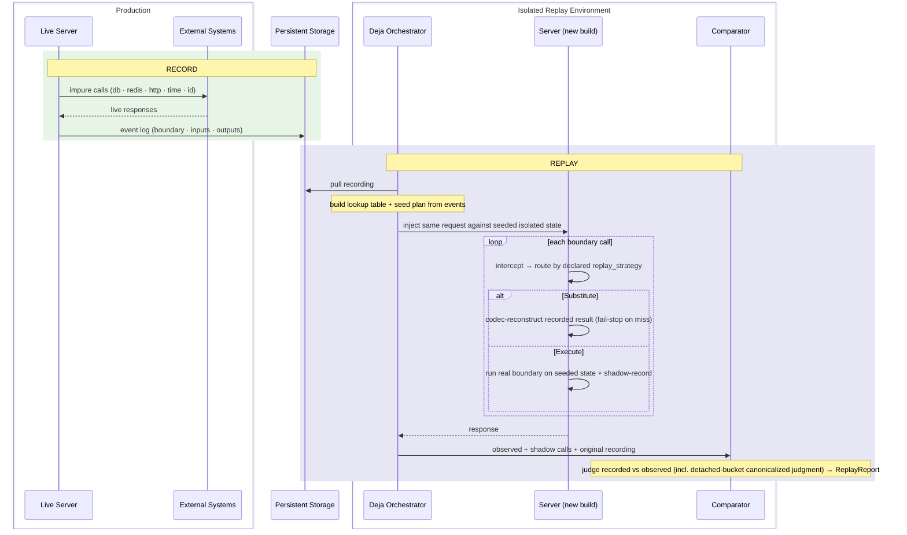
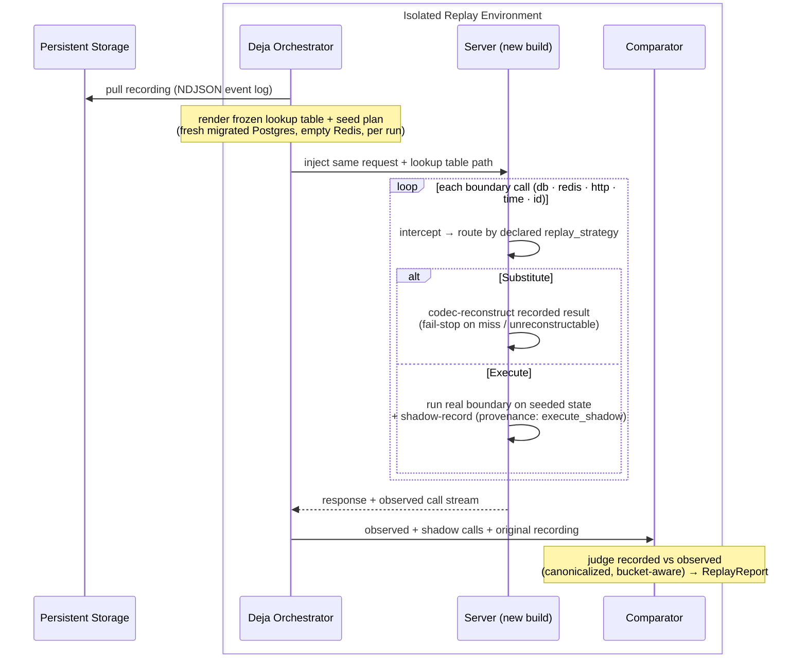

Deja makes a Hyperswitch run deterministically replayable — it records every interaction with an external system during a live run and replays that run against the recording: substituted boundaries return the recorded answers, and execute boundaries re-run against state seeded from the tape.

## Table of Contents

- [Overview](#overview)
- [Record](#record)
- [Replay](#replay)

---

## Overview

### Pure and impure functions

A **pure function** is one whose output depends only on its inputs. Given the same input, it always returns the same output — no hidden state, no side effects. Regression testing a pure function is straightforward: to verify that a refactored implementation `f'` is equivalent to the original `f`, check that `f(x) == f'(x)` for a representative set of inputs. The inputs are the entire state of the world that matters.

A server can be imagined as a function: it maps a request to a response. But real servers are overwhelmingly **impure** — their responses depend on state that is not part of the request:

- **Entropy** — `now()` returns a different value on every call; generated IDs (UUIDs, nonces) are different on every run.
- **Side effects** — query results depend on what was written to the database before; Redis cache contents change; downstream payment processors and fraud APIs return live responses that cannot be replayed.

These are not flaws — they are the reason the server exists. But they mean that two calls with identical request bytes can produce different responses. A given production run is effectively unreproducible from the request alone, because the request does not encode the state of the world that shaped the response.

### The consequence for regression testing

For a pure function, `f(x) == f'(x)` is both necessary and sufficient to establish equivalence. For an impure server, it is neither: the same request replayed against a new build will contact different live systems, get different database rows, and see a different clock. The comparison becomes `f(x, world₁)` vs `f'(x, world₂)` — two different inputs. Any observed divergence could be the code change or the world change; any observed equivalence could be masking a real regression.

Synthetic tests approximate `world` with mocks and fixtures, which is useful but limited. They cannot catch regressions that depend on the specific combination of responses real systems produced during a real run. And when an incident occurs, the exact world state that triggered it is usually gone.

### How Deja closes the gap

Deja's insight is that you do not need to eliminate the impurity — you need to **record it**. During a live run, every call to an external system is intercepted at its boundary and both the inputs and the output are captured in a structured event log. That log is a faithful description of the world as seen by the server during that run.

To replay the run against a new build, a second server instance is driven with the same request. Each time it would call an external system, it sees the recorded world — the same database results, the same Redis values, the same processor responses, the same clock readings, the same generated IDs. The comparison becomes `f(x, world) == f'(x, world)`: same code input, same world. Any divergence is unambiguously the code change.

### How we transform the service into pure in replay mode

Replay is **per-site, not global**: every boundary declares `replay = Execute | Substitute` (default `Substitute`). A Substitute site reconstructs the recorded result through its declared codec and **never executes live code** — reconstruction is two-state (`Reconstructed::{Value,Failed}`), and a lookup miss, a recorded-`Err` sentinel, or a malformed capture all fail-stop the one request rather than falling through to a live boundary or serving stale data. An Execute site re-runs the real function against per-correlation state seeded from the recording and shadow-records the outcome for post-hoc comparison. The tape is a **partial function** — there is no global substitute-everything policy.

This is the mechanism that makes regression testing tractable. The recording is the world. Two builds replayed against the same recording are two evaluations of a pure function under identical inputs. Any difference in output is a code change, not noise.

The mechanism is **memoization of impure calls**. Recording builds a cache: for each boundary call, store the response that was returned. Replay performs a cache lookup at Substitute sites. The lookup key is **callsite identity + args + occurrence**: the arguments captured via `deja::capture!` (hashed), the callsite's structured identity, and the per-callsite occurrence within the request — partitioned per correlation and per task-lineage bucket. Position alone is no longer the key: args participate for stateful boundaries, while entropy sites (`now()`, id generation, which have no stable args→output relationship) still disambiguate by occurrence. Shadow↔recorded pairing for Execute sites is an args-free identity-join + occurrence, since a diverging value changes downstream args and would otherwise split the pair.



### Intended use

**Record** runs in production or staging alongside normal traffic. The instrumented build intercepts boundary calls and writes events out-of-band to durable storage — reusing Hyperswitch's existing Kafka → object storage pipeline. The server continues serving normally. A failure anywhere in the recording path is logged and dropped; the payment response is never held or affected.

**Replay** runs in an isolated environment: no live payment processors, no production credentials. A harness pulls the recording from storage and drives a second server instance against the same request. Substitute boundaries receive the recorded answers; Execute boundaries run for real against tape-seeded local state. A comparator scores the result and reports any divergence.

### Value delivered

- **Regression safety.** Replay a production recording against a modified build to confirm behavior is unchanged before shipping — deterministically, not approximately.
- **Incident diagnosis.** Reproduce the exact world state from a failure offline, without production infrastructure or credentials.
- **Testing without live dependencies.** Recordings substitute for real payment processors and seed local databases and caches in CI and development.
- **Change confidence.** A divergence report tells you precisely which calls, if any, produced different outcomes after your change.
- **Auditability.** A complete, inspectable record of what every external system returned for a given transaction.

### Key properties

- **Off by default.** Instrumentation is compiled out entirely when the `deja` Cargo feature is off. At runtime, `runtime_hook_from_env()` reads `DEJA_MODE` (`record` | `replay` | `disabled`/`off`/`none`; auto-record when only `DEJA_ARTIFACT_DIR` is set) and returns no hook when disabled; the inactive placeholder is `DisabledHook`.
- **Non-invasive.** Deja wraps calls at their boundaries without modifying payment logic or control flow.
- **Infrastructure reuse.** Events flow through Hyperswitch's existing Kafka → Vector → S3 event bus. No new production infrastructure is required.
- **Fails safe.** The recording pipeline is fire-and-forget from the request handler's perspective. A stall or error is logged and dropped; the payment response is never blocked.

### Status and roadmap

Recording is working end-to-end: boundary events flow from instrumented call sites through the pipeline to MinIO/S3 as NDJSON. Replay is **proven**, not merely foundational:

- **Proof evidence (built).** An 8-candidate isolated-parallel replay matrix is green on the drain-free tape `rec-1783342759`: self/benign candidates pass 9/9 correlations with zero divergences; six seeded regression classes are caught — real divergence, earlier-fork, dropped-write, response-only, extra-call, and a 3-call transitive derivative chain reported as `ValueDivergedOrigin` plus args-free-paired downstream consequences. Plus a 5× repeated-replay determinism soak with identical verdicts and an on-tape neutrality proof (natural interleaving, zero drain events).
- **Event schema (built).** Events are `BoundaryEvent` at wire schema v8 (v6 = `capture!` args; v7 = lineage/canonicalization scaffolding; v8 = stamp-only detached model + canonical `bucket_id`/`fork_seq`). Required wire fields include `request`/`response`/`event_schema_version`/`provenance`/`replay_strategy` and fidelity (wire name pinned `recon`); version skew is tolerated via serde defaults on additive fields.
- **Detached work (built).** The response-end drain is deleted. `deja::spawn_detached` is a pure lineage stamp; correctness of fire-and-forget effects is judged at replay against declared canonicalization (ratified source: `docs/design/effect-algebra.md`; see [Correlation](#correlation) and [Replay](#replay)).
- **Outgoing HTTP replay (built).** Egress is replayed: `codec = HttpResponseCodec` rebuilds the `reqwest::Response` (status + headers + body) from the tape. Egress is lookup-only (Substitute) by declaration.
- **Callsite identity (built).** The macro builds a `CallsiteIdentity` per invocation (syntax hash + span-path scope + per-correlation occurrence); events carry structured identity and replay resolves at strong ranks.
- **Data capture is unmasked today (deliberate deferral).** Headers and bodies are recorded verbatim — that is what makes reconstruction lossless. Access control on tapes is the shipped mitigation; producer-side redaction/masking remains designed but unbuilt (`docs/REPLAY_PLATFORM_DESIGN.md`).
- **Publish / PR state (in flight).** The library is public at `github.com/juspay/deja`; Hyperswitch PR #12754 is a 2-commit curated series consuming it as a rev-pinned git dependency across 8 crate manifests (the local vendor trees stay path-based for development until the W5 repin). A merge-readiness program is in flight: W1 done (rebased onto current upstream main on branch `deja-lean-main`, all 13 ci-local gates green incl. locked-schema migrations); W2 feature-off purity in progress; W3 (typed `DejaSettings` config): design underway, nothing landed — env vars remain the shipped mechanism; W4 (moving the harness overlay out of the vendor tree into the deja repo): pending — the overlay is still in-tree today; W5 republish + PR refresh pending. None of W2–W5 is landed.

The library ships as ten crates: `deja` (facade), `deja-derive` (macros), `deja-runtime` (record + replay), `deja-context`, `deja-core`, `deja-kernel`, `deja-store`, `deja-compactor`, `deja-orchestrator`, and `deja-tui`.

---

## Record

### Instrumentation model

Every Deja annotation is applied via `#[cfg_attr(feature = "deja", ...)]`. When the `deja` Cargo feature is off the attribute — and the `deja` crate itself — are not linked. When the feature is on but the hook is inactive, args are captured only `if ::deja::__private::capture_is_active()`, so the inactive path costs a single check and the argument JSON is never built.

For an annotated `async fn`, the `deja-derive` proc macro rewrites the body into a single call through one dispatch seam:

```rust
#[track_caller]
pub async fn get_key<V>(&self, key: &RedisKey) -> … {
    // Built once per invocation: BoundarySpec (declared replay/effect/op/returns)
    // + CallsiteIdentity (syntax hash, lexical path, span path, occurrence)
    // + correlation + declared state keys → one CrossingObservation.
    let __deja_args = if ::deja::__private::capture_is_active() {
        Some(/* per-argument deja::capture! */)     // lazy — never runs when inactive
    } else { None };
    ::deja::__private::dispatch_async(
        __deja_observation,
        __deja_args,                                 // args thunk
        async move { /* original body verbatim */ }, // run thunk
        /* reconstruct: recorded JSON → Reconstructed<T>::{Value, Failed} */,
        /* extract: &T → lossless result image + is_error (codec-owned)   */,
    ).await
}
```

All run/skip/shadow/record control flow lives inside the seam — the macro names no replay-only operation, and the hand-written DB macro calls the same `dispatch_async`. Three properties make this both safe and cheap:

- **Lazy args.** Argument capture is gated on `capture_is_active()` and handed to the seam as a thunk; there is no serialization cost on the hot path.
- **Codec-owned results.** Capture and reconstruction are owned by the declared `codec =` (`ReplayCodec::capture` / `::reconstruct`) — built-ins `SerdeCodec` and `ResultOkCodec`, plus custom codecs like `HttpResponseCodec` for non-serde types. The captured value becomes `BoundaryEvent.result`. An explicit `result =` closure survives only as an escape hatch that wins when present.
- **Forced `#[track_caller]`.** The macro injects `#[track_caller]` if it is absent, so `Location::caller()` captures the application callsite — the real source location that called the annotated function — not the generated wrapper.

**Declaration surface (canonical, per site):** `codec =` (SerdeCodec | ResultOkCodec | custom `ReplayCodec`), `replay =` (`Execute` | `Substitute`), descriptive `effect`/`op`/`returns` metadata (seed planning and reporting only — never routing), and explicit state-key facts `state_read`/`state_write`/`state_touch`. Args are captured per-argument via the autoref-specialized `deja::capture!`: structured serde preferred → tagged `{"debug": …}` fallback → tagged opaque markers, never silent nulls. Legacy spellings (`replay_strategy`, `replay_codec`, `effect_kind`, …) are rejected with a diagnostic naming the canonical key.

There are four kit presets — `deja::redis`, `deja::http`, `deja::time`, `deja::id` — via `generate_with_preset`, each carrying a preset replay default: redis → `replay = Execute` against the seeded store; time/id → `Substitute` (clock and entropy are never re-run). `deja::crypto` and `deja::lock` no longer exist — see the note under the table. DB and `http_incoming` are not attribute macros; the rationale is in [Key design decisions](#key-design-decisions-brief-rationale-for-non-obvious-choices).

---

### What we instrument

| Boundary | Where annotated | What is captured |
|---|---|---|
| **redis** | `redis_interface/src/module/{fred,redis_rs}/commands.rs` — 46 annotated `RedisConnectionPool` methods (38 fred-backend + 8 redis_rs-backend) | Command verb, keys, options; value-returning read/write paths mirror replies into serde-native `DejaRedisValue` under `codec = ResultOkCodec`, while the remaining sites (streams, consumer groups, EVAL, multi-key summaries) capture via explicit `result =` closures or the Debug record-only default; explicit tenant-aware `state_read`/`state_write` key facts. Preset `replay = Execute`; ops unsafe to re-run (accumulative RMW, destructive, conditional, streams, EVAL) declare `replay = Substitute` at the site. |
| **http_outgoing** | `external_services/src/http_client.rs` — `send_request` only (single egress chokepoint) | Method, URL, `X-Request-ID`, headers (verbatim, unmasked), query, timeout, TLS flags, request body bytes; response `{status, reason, response_headers, response_body}`. Declared `codec = HttpResponseCodec` makes egress replayable from tape (Substitute-only). Active path only — gated on activity before any allocation. |
| **http_incoming** | `router_env/src/request_id.rs` — `EitherBody` Actix middleware | Method, path, query, request id, status, headers, request body, response body — buffered through `RecordingBody<B>` and finalized on stream end. Declares `reply_canon` `project:!created_at,!last_synced,!modified_at`, matching the DB row seams. |
| **db** | `diesel_models/src/query/generics.rs` — 13 `record_deja_db_query!` invocations across the generic helpers | Operation name plus declared `OperationKind` (Read/Create/Update/Delete…), table, SQL rendered once via `debug_query::<Pg,_>`, input parameters; result as the versioned **`DejaDatabaseResult` envelope** (typed Ok payload with row images carrying producer column metadata, or a typed Err) — no Debug-string scraping. Row-returning seams declare query state keys and volatile-column canonicalization `project:!created_at,!last_synced,!modified_at` as tape metadata (judged replay-side; zero runtime effect). |
| **time** | `common_utils/src/lib.rs` — `date_time::now`, `now_unix_timestamp`, `date_as_yyyymmddthhmmssmmmz`, `now_rfc7231_http_date` | No args; the timestamp value. Preset `Substitute` — the clock is never re-run. |
| **id** | `common_utils/src/lib.rs` — `generate_id*` family; `router_env` — `generate_uuid_v7`; `common_utils/src/crypto.rs` — the AEAD nonce (`GcmAes256::nonce`, Ok-only) and the CSPRNG key/password string generator; plus 6 `router`-crate id seams (user-id/password/JWT-exp and id generators) | Generated value. `*_of_default_length` callers carry `#[track_caller]` so the recorded callsite is the application caller, not the wrapper. Preset `Substitute`. |

**Deliberately un-instrumented.** `crypto_operation` (`hyperswitch_domain_models/src/type_encryption.rs`) is NOT a boundary: it is pure computation over inputs that are all deterministic on replay; its only nondeterminism — the AEAD nonce — is captured at its `deja::id` seam. Locking (`router/src/core/api_locking.rs`, `perform_locking_action` / `free_lock_action`) is NOT a boundary: it is a redis SETNX retry loop, so once redis is hermetic the lock outcome replays from the recorded redis reply, and a lock wrapper would only double-record (substituting it would skip — and thus omit — the inner redis call).

---

### Correlation

`RequestIdMiddleware` (`router_env/src/request_id.rs`) is the single integration point. On the active path, `Service::call` extracts (or generates) the request id and wraps the inner-service future in `deja::__private::scope_correlation` (a re-export of `deja_context::scope`), which re-enters a `ContextSnapshot(correlation_id)` on **every poll** of the wrapped future and restores it on drop. All boundary calls executed inside the request future call `current_correlation_id()`, which reads that thread-local, so they inherit the request id as `correlation_id` without any explicit argument threading. Downstream annotations use `correlation=None` (the macro default), which triggers the ambient fallback.

**Detached work.** Fire-and-forget work uses `deja::spawn_detached`: it always delegates immediately to `tokio::spawn` in every mode and is a **pure lineage stamp** — the current context/span is captured at spawn and re-entered while the child is polled, and the child's events are stamped `detached = true`, `task_id`/`parent_task_id`, a lineage `bucket_id`, and a `fork_seq`. Recording is observationally neutral: it never defers, joins, or reschedules (ratified source: `docs/design/effect-algebra.md`). There is no `deja-tokio` crate, no scope middleware beyond `RequestIdMiddleware`, no custom runtime builder, and no `tokio_unstable` requirement.

---

### The BoundaryEvent record

Each boundary call produces one `BoundaryEvent` — a single memoization cache entry. It captures the call's identity (where it was made, which occurrence), its inputs (`args`), and its output (`result`). During replay the identity fields serve as the lookup key; the `result` is the value reconstructed at Substitute sites. Key fields:

| Field | Meaning |
|---|---|
| `global_sequence` | Process-wide monotonic `AtomicU64` counter, no gaps across all requests. Establishes total ordering. |
| `request_sequence` | Per-correlation sequence. Establishes ordering within one request. |
| `correlation_id` | The `X-Request-ID` of the enclosing request; detached work inherits it (see [Correlation](#correlation)); `null` only for genuinely uncorrelated events. |
| `boundary` | One of `http_incoming`, `http_outgoing`, `redis`, `db`, `time`, `id`. |
| `trait_name` / `method_name` | The `component=` and `operation=` annotation fields, e.g. `RedisConnectionPool` / `get_key`. |
| `args` | Call inputs captured per-argument via `deja::capture!` (see [Instrumentation model](#instrumentation-model); schema v6); an explicit `args = {…}` block survives only as an escape hatch. |
| `request` | A copy of `args` (set on finish). |
| `result` / `response` | The captured return value, produced by the declared `codec =`. At replay a Substitute site reconstructs the typed return through the same codec into `Reconstructed::{Value,Failed}` — `Failed` fail-stops, as does a lookup miss; a Substitute site never executes live code. |
| `is_error` | Whether the call returned an error. A recorded `Err` is stored as the non-reconstructable `{"deja_err": …}` sentinel under Ok-only capture. |
| `detached` / `task_id` / `parent_task_id` / `bucket_id` / `fork_seq` | Detached-lineage stamps from `deja::spawn_detached` (schema v8). Occurrence/lookup partitioning is per (correlation, bucket, callsite). |
| `provenance` | Required: `recorded` \| `execute_shadow` — lets the post-hoc tally pair recorded vs shadow events to classify `ValueDiverged`. |
| `recon` | Required: pinned wire name for the `Fidelity` field (`lossless` \| `structured` \| `opaque`; currently inert — always lossless). |
| `replay_strategy` | Required: the per-site `Execute` \| `Substitute` knob stamped on every event — the replay-routing source of truth. No global policy. |
| `declaration` | Optional typed effect/op/returns metadata plus `reply_canon`/`state_canon` canonicalization declarations — judged by the divergence scorer, never used for routing. |
| `duration_us` | Elapsed microseconds across the dispatch. |
| `call_file` / `call_line` / `call_column` | `#[track_caller]` callsite — the application site that called the annotated function. |
| `callsite_identity` | Structured identity (span path, syntax hash, lexical path, per-scope occurrence) built once per invocation by the macro. On the current proof tape 197/207 events carry it (all except http_incoming middleware events) and replay resolves at ranks 2–3. |
| `recording_run_id` | Stable run identifier (`DEJA_RECORDING_RUN_ID → DEJA_RUN_ID → run-{now_ns}`), shared across all events in one recording session. |
| `event_schema_version` | Required wire field (no serde default — recordings must carry it). Current version **8**: v6 = autoref `capture!` args; v7 = task-lineage/canonicalization scaffolding; v8 = stamp-only detached spawning + canonical `bucket_id`/`fork_seq`. Compatibility comes from per-field `#[serde(default)]` on added fields. |

---

### Transport pipeline

Each `BoundaryEvent` flows through a single shared `Arc<RecordingHook>` → `AsyncRecordWriter` (bounded channel, worker thread, configurable batch size and flush interval) → hardened Kafka record sink (`RecordSink<deja::BoundaryEvent>`). The local demo and production-shaped path use Kafka as the sole durable sink for recording events; the old JSONL primary is no longer the source of truth.

`HyperswitchKafkaRecordSink` wraps each event in the `deja.artifact_record/v2` envelope:

```json
{
  "schema_version": 2,
  "artifact_type": "deja_artifact_record",
  "instance_id": "<service-host-boot>",
  "capture": { "mode": "session", "session_id": "<recording>" },
  "code": { "sha": "<producer-sha>", "deja_version": "<deja-version>" },
  "event_time_ns": 0,
  "event": { /* BoundaryEvent */ }
}
```

The Kafka partition key remains correlation-oriented so one request's events stay ordered on one partition; uncorrelated background events partition deterministically by producer/sequence identity. The sink uses the Deja-owned producer configuration described in the Phase 2 store plan (`acks=all`, idempotence, bounded buffering, and real flush), and loss-accounting records ride the same topic as `deja_sink_marker` envelopes.

**Downstream:** Kafka topic `hyperswitch-deja-recording-events` (local demo broker `kafka0:29092`) → Vector pipeline `deja_recording` source → S3-compatible storage. Vector lands the full envelope (no unwrap transform) under `landing/v1/session={capture.session_id}/inst={instance_id}/` with zstd NDJSON objects and S3 acknowledgements enabled. The compactor seals the session by writing `sessions/v1/{id}/data/`, `sessions/v1/{id}/index/`, and `sessions/v1/{id}/manifest.json` (manifest written last). Replay preparation then uses `deja-orchestrator::s3::pull_recording` to read the sealed session, unwrap envelopes, dedup/sort by recording identity and `global_sequence`, and materialize the harness copy at `{harness-root}/recordings/{id}/events.jsonl`.

```mermaid
flowchart LR
    SE[BoundaryEvent] --> RH[RecordingHook\nAsyncRecordWriter]
    RH --> KS[Hardened KafkaRecordSink\ndeja.artifact_record/v2\nsole durable sink]
    KS --> KT[Kafka topic\nhyperswitch-deja-recording-events]
    KT --> VC[Vector\nfull envelope, zstd NDJSON]
    VC --> LAND[MinIO / S3\nlanding/v1/session=.../inst=.../]
    LAND --> COMP[deja-compactor\nmanifest seal]
    COMP --> S3[MinIO / S3\nsessions/v1/{id}/]
    S3 --> API[deja-orchestrator pull_recording\nrecordings/{id}/events.jsonl]
```

`deja_boot::install` still runs in `main` before the first `OnceLock` getter fires. In record mode, a fatal Kafka setup failure leaves recording off and logs loudly rather than aborting router boot; transient delivery/backpressure behavior is governed by `DEJA_SINK_POLICY` (`block` for local proof/CI, `fail_open` for payment-path safety).

---

### Compliance

HTTP headers and bodies are captured verbatim on both the incoming and outgoing boundaries. **Capture is verbatim/unmasked today — a deliberate deferral**: verbatim capture is what makes reconstruction lossless, and access control on tapes is the shipped mitigation. Producer-side redaction/masking remains designed but unbuilt (`docs/REPLAY_PLATFORM_DESIGN.md`). A recording may contain API authentication tokens, payment card data, and personally identifiable information.

There is no crypto boundary. `crypto_operation` is deliberately un-instrumented (pure computation; its inputs arrive via other recorded boundaries). Entropy feeding crypto IS recorded via `id` boundaries: the AEAD nonce (`GcmAes256::nonce`, Ok-only — the real AES still runs; only the random nonce is substituted) and `generate_cryptographically_secure_random_string` (used for keys and passwords) — so generated key material CAN land on the tape.

Recordings must therefore be treated as secrets: access-controlled storage, no sharing outside authorised engineering contexts, and no retention beyond what the active replay use case needs.

### Timelines and scope

**Publish / PR state:** PR #12754 is a 2-commit curated series consuming deja as a rev-pinned git dependency (`juspay/deja` @ `2f8e3bb52cd3…` across 8 crate manifests). A merge-readiness program is **in flight**: W1 rebase onto current upstream main DONE (branch `deja-lean-main`, all local CI gates green incl. locked-schema migrations); W2 feature-off purity IN PROGRESS; W3 (typed `DejaSettings` config): design underway, nothing landed — env vars like `DEJA_MODE` remain the shipped mechanism; W4 (moving the harness overlay `docker-compose.deja.yml` / `vector.deja.yaml` out of the vendor tree into the deja repo): pending — the overlay is still in-tree today; W5 republish + PR refresh pending.

**Proof basis:** on the drain-free tape `rec-1783342759` (207 events, natural interleavings, zero drain events), the isolated-parallel candidate matrix runs green — self/benign replay passes 9/9 correlations with zero divergences, while mutated candidates are caught (e.g. one candidate flagged with `ValueDiverged` plus a non-blocking order-nondeterminism warning, verdict fail). Scorecards, seed certificates, and per-run visualizations are on disk under `demo/harness-state/1783342759/`.

---

### Key design decisions (brief rationale for non-obvious choices)

**DB uses `macro_rules!` not an attribute macro.** The diesel generic helpers render SQL once (`debug_query::<Pg,_>`) before executing. An attribute macro wraps a function call; `macro_rules!` wraps a block, allowing the SQL string to be captured before the async body executes. With the deja feature on, rows must serde round-trip: the bound is `R: Debug + Send + 'static + DejaQueryResult`, where `DejaQueryResult` = `Serialize + DeserializeOwned` (an empty marker trait when the feature is off, so default builds are unaffected). The seam is envelope-only: results travel as the versioned `DejaDatabaseResult`, and replay reconstructs through `Reconstructed::{Value,Failed}` — a recorded-Err sentinel or malformed capture fail-stops rather than running live SQL.

**`http_incoming` is middleware not an attribute macro.** Capturing the response body requires buffering a streaming `MessageBody` across polls — a `Transform`/`Service` pair. An attribute macro wraps a single function call and cannot intercept the stream that Actix drives incrementally after the handler returns.

**Instrument at the diesel generics layer, not at each repository call site.** The generic helpers (`generic_insert`, `generic_update`, `generic_find_by_id`, `generic_filter`, and so on) sit below the typed repository layer. Thirteen `record_deja_db_query!` applications cover every table in the schema without touching any per-table query code.

**One shared `Arc<RecordingHook>` for both hook resolvers.** Two process-wide resolvers exist: `global_runtime_hook_from_env()` (used by the id-generation and request-id paths) and `global_hook_from_env()` (used by the db/redis/http boundaries). Without sharing they would each initialize their own `RecordingHook`, producing two independent `AtomicU64` sequence counters and two sink instances — duplicate `global_sequence` values and under-delivery. `global_hook_from_env()` peeks `GLOBAL_RUNTIME_HOOK` first; if a `RuntimeHook::Recording` is installed, it returns an `Arc::clone` of that hook's inner `RecordingHook` rather than initializing a second one.

---

## Replay

### Replay workflow

The harness pulls the NDJSON recording from object storage, renders it into a frozen lookup table, and materializes a **seed plan** (emitting a seed certificate) before the recorded requests are driven. It then drives a second Hyperswitch instance against the same request. Every boundary call routes by its declared `replay_strategy`: Substitute sites are answered from the recording (fail-stop on a miss); Execute sites re-run the real DB/Redis code against per-run seeded, isolated state and write shadow events (`provenance: execute_shadow`) that the orchestrator pairs with the baseline post-hoc.



The replay candidate runs with `DEJA_MODE=replay`. No external egress happens — outgoing HTTP is served entirely from the tape — but Execute-declared boundaries really run against local, tape-seeded datastores. The harness resolves the recording from a shared volume mount; the deja library itself never reaches out to object storage.

**Two replay modes.** There are two distinct `RuntimeHook` variants for replay:

| Variant | Env | Mechanism | ArgMismatchPolicy |
|---|---|---|---|
| `Replay` (`ReplayHook`) | `DEJA_MODE=replay` | In-process identity-first cascade (explicit / syntactic-hash / lexical identity, then positional fallbacks: location-exact, sequence+method+args, sliding window) — independent of the rank 1–6 ladder | Applied (`Never` / `OnlyForArgful` (default) / `Always`) |
| `LookupReplay` (`LookupTableHook`) | `DEJA_MODE=replay` + `DEJA_LOOKUP_TABLE` set | O(1) hash-map lookup from orchestrator-pre-rendered table | Not applied — policy lives in orchestrator |

When the Deja orchestrator harness drives replay, it pre-renders the recording into a frozen lookup table (JSON/JSONL) and injects the path via `DEJA_LOOKUP_TABLE`. The candidate's `LookupTableHook` performs a single O(1) lookup per call — no cascade, no in-process policy. The candidate emits an `ObservedCall` record per call to `DEJA_OBSERVED_SINK`; divergence detection runs post-hoc in the orchestrator. This is the production harness path.

### How do we achieve full mock?

Substitute replay is a **memoization lookup**. The recording is the cache; each `BoundaryEvent` is a cache entry. For every Substitute call the replay candidate makes, the lookup returns the stored response instead of hitting a live system — and the guarantee is **fail-stop, never fall-through**: reconstruction is two-state (`Reconstructed::Value` / `Reconstructed::Failed`), a recorded `Err` is stored as a non-reconstructable `{"deja_err": …}` sentinel, and both a `Failed` reconstruction and a lookup miss halt the one request rather than silently running the real boundary or serving stale data. Reconstruction is declared per site via `codec =` — built-in `SerdeCodec` (whole-value serde) and `ResultOkCodec` (Ok-arm only), or a custom `ReplayCodec` such as `HttpResponseCodec`; a site with no codec declaration is record-only Debug capture whose result cannot be reconstructed (fail-stop if substituted). The DB seam records the versioned `DejaDatabaseResult` envelope only.

The lookup key combines **callsite identity, args, and occurrence**. Deja uses a rank-aware address ladder for the identity component, falling back from stronger to weaker discriminators:

| Rank | Kind | Discriminator |
|---|---|---|
| 1 | `Explicit` | Caller-supplied address |
| 2 | `SpanPath` | Root→leaf `tracing` span-name path — survives benign line-shift edits and disambiguates concurrent same-callsite calls |
| 3 | `SyntacticHash` | Macro-time hash of `boundary::operation` |
| 4 | `LexicalPath` | `module_path` + per-scope occurrence |
| 5 | `SourceLocation` | `call_file:call_line:call_column` |
| 6 | `Sequence` | Position in the event stream — positional last resort |

Occurrence keys are additionally partitioned by task lineage: same-callsite occurrences are scoped per (correlation, lineage bucket, callsite) using the event's `bucket_id`/`fork_seq` stamps, so detached-task calls never collide with main-path occurrences. The ladder takes the strongest available hit; a Substitute miss fail-stops.

Callsite identity is **shipped**: the macro codegen builds a `CallsiteIdentity` once per invocation (syntactic hash, lexical path, span path, per-scope occurrence) and stamps it on every event, so the strong ranks are operative; rank resolution is reported per run (`resolved_by_rank` in the scorecard — the current proof tape resolves at ranks 2–3).

**Detached work.** Fire-and-forget effects are not forced to finish before the response: recording is observationally neutral and replay executes freely. **Order-tolerant judgment replaces execution determinism** (ratified: `docs/design/effect-algebra.md`): the scorer judges per-(correlation, bucket, callsite) occurrences against declared canonicalization — never against the tape's accidental linearization.

### How do we classify intended and unintended diff?

After the replay run, the observed and shadow boundary calls are compared against the original recording. The divergence taxonomy:

- **`OmittedCall`** — a recorded call was skipped in the replay. Indicates skipped code paths.
- **`NovelCall`** — a call not present in the recording. A novel Execute call with no baseline is blocking, not a swallowed gap.
- **`ArgsDiverged`** (wire name `field_mismatch`) — arguments differ from the recorded baseline at the same position.
- **`ValueDiverged{recorded, observed, callsite, occurrence}`** — an Execute site produced a different **value**. A recorded-omitted write and an execute-novel write are paired **args-free** (identity-join + occurrence) into one divergence, since the diverging value changes the args and would otherwise split them.
- **`InconclusiveSeedGap`** — the baseline needed for comparison was absent: reported as inconclusive, never counted as a match or a divergence.
- Plus `DeserializationFailure`, `Recovered`, `CorrelationMismatch`, `ArgSkipBlocked`.

The orchestrator adds cause-vs-consequence lanes: `ValueDivergedOrigin` marks the originating read so downstream consequences are attributed to it, alongside omitted/novel/environmental/`inconclusive_race` lanes.

The blocking-vs-drift policy is **built, declared, and judged** — not open. Boundaries declare canonicalization presets applied by the scorer before judging (never by runtime routing): `final_state`, `absent_after`, `project{include,exclude}`. Volatile columns are declared `project:!created_at,!last_synced,!modified_at` on the DB row seams with a matching `reply_canon` on `http_incoming`. Blocking vs non-blocking is explicit in the verdict: seed gaps, order-nondeterminism, and idempotent-delete lines are non-blocking; evidence-gated `inconclusive_race` rows (recognized only when the run's HTTP layer is clean) make the verdict `inconclusive` with an auto-rerun recommendation — a race-only run can never pass.

The comparator produces a `ReplayReport` and a scorecard containing a Summary (matched/total correlations, side-effect and value divergences, inconclusive races/seed gaps), per-boundary and per-correlation breakdowns, warnings, and a three-state `Verdict {pass, inconclusive, reason}`. Latency/resource scoring does not exist today; if added it would be future work.

### Timelines and scope

**Publish / PR state (in flight):** the library is published as the public repo `juspay/deja`; PR #12754 (the curated upstream series) consumes it as a rev-pinned git dependency, while the local vendor trees stay path-based for development until the W5 repin. The merge-readiness program is in flight, not landed: the vendor tree is rebased onto current upstream Hyperswitch main (W1), and the checklist still requires a fresh public Deja rev, dependency repin, final vendor gates, and approval before any public push. Config idioms (moving the `DEJA_MODE`/`DEJA_LOOKUP_TABLE`/`DEJA_OBSERVED_SINK` env surface into typed Hyperswitch settings) are W3 — design underway, nothing landed; the env vars remain the shipped mechanism.

**Proof evidence (built):** the 8-candidate cross-version matrix against one golden recording on the drain-free tape `rec-1783342759` — see [Status and roadmap](#status-and-roadmap). Prior clean isolated-parallel matrix proofs are enumerated in `docs/PR_FINALIZATION.md`.

### Open replay gaps

Two previously documented gaps are **closed**: outgoing HTTP is replayed via `HttpResponseCodec` (status + headers + body reconstructed into a real `reqwest::Response`), and callsite identity is emitted by the codegen on every macro-boundary event.

What remains open is residual, and surfaced rather than silent: heavy reliance on rank-6 (positional) matching after large restructuring is fragile — the detector reports per-rank counts so rank-6-heavy runs are flagged; and recognized read races produce `inconclusive` verdicts requiring an auto-rerun rather than a pass.

---

## Risks

**Data sensitivity in recordings.** HTTP headers, request bodies, and response bodies are captured verbatim — unmasked today by deliberate deferral, with access control on tapes as the shipped mitigation; downstream masking/redaction is a separate deferred workstream, designed but unbuilt (`docs/REPLAY_PLATFORM_DESIGN.md`). A recording from production traffic may contain API keys, session tokens, payment card data, and PII. Recordings must be treated as sensitive artifacts — access-controlled storage, no sharing outside authorised engineering contexts, and no retention beyond what is needed for the active replay use case.

**Replay fidelity under code restructuring.** Matching is a 6-rank strongest-first ladder; positional sequence is the rank-6 last resort, and the detector reports `resolved_by_rank` so rank-6-heavy runs are flagged rather than silent. A Substitute miss no longer hands a wrong recorded value to the call — it fail-stops the one request (a blocking `NovelCall`). Residual risk: heavy reliance on rank-6 after large restructuring is fragile, but it is surfaced, not silent.

**Detached (fire-and-forget) nondeterminism.** Detached work is not forced to finish — the response-end drain is deleted and recording is observationally neutral (`deja::spawn_detached` always `tokio::spawn`s immediately and only stamps lineage). Late or racing detached writes are **judged, not serialized**: occurrences are keyed per (correlation, bucket, callsite); volatile columns are canonicalized via declared presets; recognized races become `inconclusive_race` with auto-rerun recommended, and race-only runs never pass. Ratified source: `docs/design/effect-algebra.md`.

**Recording performance tail.** The `AsyncRecordWriter` uses a bounded sync channel (default 8192 capacity). Under sustained high-volume traffic, back-pressure from a slow Kafka broker can block in local/CI `DEJA_SINK_POLICY=block` mode or drop/count events in `fail_open` mode. Sink metrics plus session manifests are the integrity signal; request handling must not depend on the record path staying healthy.

**Recordings grow at O(traffic × boundaries).** A single payment request records ~25–55 `BoundaryEvent` entries on current instrumentation (~200 for the 9-request demo workload). At production scale, storage and retention must be managed explicitly. The Vector pipeline batches events at 2000 events / 5 s into S3; object lifecycle policies should be configured before enabling in production.

---

## Extensibility to self-hosted merchants

Deja is a Cargo feature flag (`deja`) on the Hyperswitch binary. A merchant running their own Hyperswitch instance gets access to Deja by building with `--features deja`; the feature is compiled out by default (an optional dependency across 8 crates). Feature-off purity — byte-identical default builds — is being proven as merge-readiness workstream W2 (in progress), not yet a verified claim.

The deja library itself lives in the public repo `github.com/juspay/deja`. Only the pushed PR #12754 branch carries a git pin (rev `2f8e3bb52cd3…` across the 8 crate manifests); the W1-rebased tree is intentionally path-based for development, and publishing a fresh public rev plus repinning the 8 manifests is the pending W5 ship cycle. The merge-readiness program is in flight, not landed.

**Local proof mode.** The supported local proof uses the same production-shaped path at small scale: Hyperswitch record mode → Kafka → Vector → MinIO/S3 landing → compactor manifest → harness-local `recordings/{id}/events.jsonl` materialization. This keeps the demo exercising the S3 contract instead of a separate JSONL-only contract.

**Full pipeline mode.** Use `DEJA_MODE=record` with the hardened Kafka sink and an existing Kafka broker. The recording flows through the merchant's Kafka → Vector → S3 stack; Vector lands full `deja.artifact_record/v2` envelopes under `landing/v1/...` and the compactor publishes sealed `sessions/v1/{id}/...` objects with a manifest-as-seal. (A `windows/v1` mode is reserved for Phase 3 — not built.) Production Vector/IAM/lifecycle ownership remains outside this PR.

**Replay.** Replay requires the NDJSON recording plus a **per-run local stack**: each run brings up its own fresh, migrated Postgres, empty Redis, superposition, and replay router in an isolated docker-compose project — because Execute-declared DB/Redis boundaries really run live code against tape-seeded state (Substitute misses fail-stop). "Fully offline" holds for external egress: no payment processors, no shared infra between record and replay environments, and the deja library never reaches out to external storage — the orchestrator mounts the recording via a shared volume and injects the path via `DEJA_LOOKUP_TABLE`.

---

## Infra requirements

### Record

| Requirement | Local proof | Full pipeline |
|---|---|---|
| Kafka broker | Local compose Kafka (`kafka0:29092`) | Existing HS OLAP Kafka or dedicated Deja recording topic |
| Vector instance | Local compose Vector with `deja_recording` source + S3 sink | Existing Vector with Deja source/sink added; full envelope, no unwrap transform |
| Object storage | Local MinIO bucket `deja-recordings` | Environment S3 bucket (for example `deja-recordings-<env>`) |
| Binary build | `--features deja` | Same |
| Runtime env | `DEJA_MODE=record`, `DEJA_SINK_POLICY=block` | `DEJA_MODE=record`, `DEJA_SINK_POLICY=fail_open` or `block` per rollout policy |

Today the overlay ships inside the vendored Hyperswitch tree (`docker-compose.deja.yml` + `config/vector.deja.yaml`); moving it out of the vendor tree into the deja repo is a pending workstream (W4) — the vendor-tree location is not final.

### Replay

| Requirement | Notes |
|---|---|
| Recording artifact | NDJSON file from record run, mounted to replay container |
| Replay binary | Same `--features deja` build, `DEJA_MODE=replay` |
| Postgres (per run) | Fresh database with migrations applied, isolated per compose project |
| Redis (per run) | Empty instance, flushed to the record run's starting state |
| `DEJA_LOOKUP_TABLE` | Path to pre-rendered lookup table (orchestrator injects this) |
| `DEJA_OBSERVED_SINK` | Path/endpoint for observed-call output (orchestrator reads this) |
| Network isolation | Replay environment must have no access to live payment processors or production datastores |
| Deja Orchestrator | Standalone harness that renders the lookup table + seed plan, brings up the per-run stack, drives the replay instance, and runs the comparator |
| Comparator | Produces `ReplayReport` + scorecard with a three-state verdict (pass / fail / inconclusive) — see [How do we classify intended and unintended diff?](#how-do-we-classify-intended-and-unintended-diff) for canonicalization and race handling |

The env-var names above remain the shipped mechanism; folding this bespoke surface into typed Hyperswitch Settings/TOML (`DejaSettings`) is merge-readiness W3 — design underway, nothing landed.
