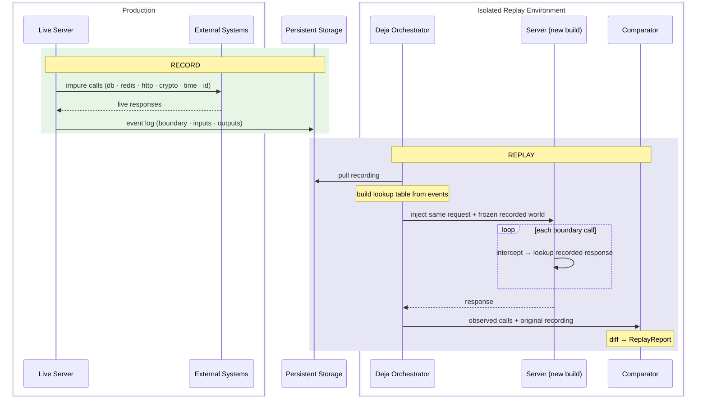
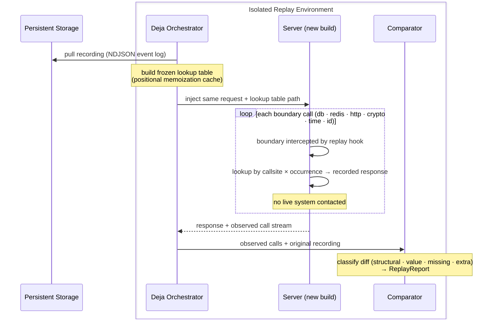

Deja makes a Hyperswitch run deterministically replayable — it records every interaction with an external system during a live run and replays that run exactly, returning recorded responses in place of live systems.

## Table of Contents

- [Overview](#overview)
- [Record](#record)
- [Replay](#replay)

---

## Overview

### Pure and impure functions

A **pure function** is one whose output depends only on its inputs. Given the same input, it always returns the same output — no hidden state, no side effects. Regression testing a pure function is straightforward: to verify that a refactored implementation `f'` is equivalent to the original `f`, check that `f(x) == f'(x)` for a representative set of inputs. The inputs are the entire state of the world that matters.

A server can be imagined as a function: it maps a request to a response. But real servers are overwhelmingly **impure** — their responses depend on state that is not part of the request:

- **Entropy** — `now()` returns a different value on every call; generated IDs (UUIDs, nonces) are different on every run.
- **Side effects** — query results depend on what was written to the database before; Redis cache contents change; downstream payment processors and fraud APIs return live responses that cannot be replayed.

These are not flaws — they are the reason the server exists. But they mean that two calls with identical request bytes can produce different responses. A given production run is effectively unreproducible from the request alone, because the request does not encode the state of the world that shaped the response.

### The consequence for regression testing

For a pure function, `f(x) == f'(x)` is both necessary and sufficient to establish equivalence. For an impure server, it is neither: the same request replayed against a new build will contact different live systems, get different database rows, and see a different clock. The comparison becomes `f(x, world₁)` vs `f'(x, world₂)` — two different inputs. Any observed divergence could be the code change or the world change; any observed equivalence could be masking a real regression.

Synthetic tests approximate `world` with mocks and fixtures, which is useful but limited. They cannot catch regressions that depend on the specific combination of responses real systems produced during a real run. And when an incident occurs, the exact world state that triggered it is usually gone.

### How Deja closes the gap

Deja's insight is that you do not need to eliminate the impurity — you need to **record it**. During a live run, every call to an external system is intercepted at its boundary and both the inputs and the output are captured in a structured event log. That log is a faithful description of the world as seen by the server during that run.

To replay the run against a new build, a second server instance is driven with the same request. Each time it would call an external system, it receives the recorded response instead. The server sees the same world — the same database results, the same Redis values, the same processor responses, the same clock readings, the same generated IDs. The comparison becomes `f(x, world) == f'(x, world)`: same code input, same world. Any divergence is unambiguously the code change.

### How we transform the service into pure in replay mode

In replay mode, every impure boundary is substituted with a deterministic lookup against the recording. The server's nondeterministic sources — the clock, the ID generator, the database, the cache, the payment processor — are all frozen to the values they returned during the original run. From the server's perspective, it is running live; from an observer's perspective, it is a pure function of its request: given the same request and the same recording, it will always produce the same response.

This is the mechanism that makes regression testing tractable. The recording is the world. Two builds replayed against the same recording are two evaluations of a pure function under identical inputs. Any difference in output is a code change, not noise.

The mechanism is **memoization of impure calls**. Recording builds a cache: for each boundary call, store the response that was returned. Replay performs a cache lookup: for each boundary call, return the stored response instead of executing live. The key distinction from ordinary memoization is that the **lookup key cannot be the call arguments** — impure functions have no stable args→output relationship (two calls to `now()` with identical arguments return different values). The key must instead encode *position in the execution*: which callsite, and which occurrence of that callsite within the request. This positional memoization is what the lookup mechanism in the Replay section implements.



### Intended use

**Record** runs in production or staging alongside normal traffic. The instrumented build intercepts boundary calls and writes events out-of-band to durable storage — reusing Hyperswitch's existing Kafka → object storage pipeline. The server continues serving normally. A failure anywhere in the recording path is logged and dropped; the payment response is never held or affected.

**Replay** runs in an isolated environment: no live payment processors, no production credentials. A harness pulls the recording from storage and drives a second server instance against the same request. The server believes it is making live calls; it is receiving the recorded answers. A comparator scores the result and reports any divergence.

### Value delivered

- **Regression safety.** Replay a production recording against a modified build to confirm behavior is unchanged before shipping — deterministically, not approximately.
- **Incident diagnosis.** Reproduce the exact world state from a failure offline, without production infrastructure or credentials.
- **Testing without live dependencies.** Recordings substitute for real databases, caches, and payment processors in CI and development.
- **Change confidence.** A divergence report tells you precisely which calls, if any, produced different outcomes after your change.
- **Auditability.** A complete, inspectable record of what every external system returned for a given transaction.

### Key properties

- **Off by default.** Instrumentation is compiled out entirely when the `deja` Cargo feature is off. The binary is byte-for-byte equivalent to standard Hyperswitch with no overhead. At runtime, `DEJA_MODE` controls behavior independently: `record`, `replay`, `disabled/off/none`, or auto-record when `DEJA_ARTIFACT_DIR` is set. When no mode is configured the `NoOpHook` is active and `is_active()` returns false with zero overhead.
- **Non-invasive.** Deja wraps calls at their boundaries without modifying payment logic or control flow.
- **Infrastructure reuse.** Events flow through Hyperswitch's existing Kafka → Vector → S3 event bus. No new production infrastructure is required.
- **Fails safe.** The recording pipeline is fire-and-forget from the request handler's perspective. A stall or error is logged and dropped; the payment response is never blocked.

### Status and roadmap

Recording is working end-to-end: boundary events flow from instrumented call sites through the pipeline to MinIO/S3 as NDJSON. Replay has a functional foundation with three active gaps:

- **Background task correlation** — Resolved. `DEJA_CORRELATION_ID` is a Tokio task-local in `deja-tokio`; `DejaScopeMiddleware` sets it per request. For raw `tokio::spawn`, build with `deja_tokio::RuntimeBuilderExt::enable_deja_context_hooks()` (requires `tokio_unstable`). Explicit wrappers `deja_tokio::spawn` / `deja_tokio::spawn_blocking` handle remaining code paths.
- **Outgoing HTTP replay** — response headers and trailers are not yet captured, so HTTP egress calls cannot be replayed. Designed-around via egress block during replay.
- **Callsite identity** — Schema shipped (`CallsiteIdentity`, `CallsiteSource` in `SemanticEvent`). The proc macro does not yet call `with_callsite_identity()`, so all on-disk events carry `callsite_identity=null`; replay falls back to rank-5 sequence matching. Emitting stable callsite IDs from the codegen is the next priority.
- **Data redaction** — HTTP headers and bodies are captured verbatim and may contain auth tokens and PII. Recordings must be access-controlled; a redaction policy is on the roadmap.

---

## Record

### Instrumentation model

Every Deja annotation is applied via `#[cfg_attr(deja, ...)]`. When the `deja` Cargo feature is off the attribute — and the `deja` crate itself — are not linked. The binary is byte-for-byte equivalent to upstream Hyperswitch. When the feature is on but the hook is inactive, `start_boundary_event_lazy` performs a single `is_active()` check and returns immediately; the `args` closure never runs, so constructing the call's argument JSON costs nothing.

For an annotated `async fn`, the `deja-derive` proc macro rewrites the function body into a start → await → finish triptych:

```rust
#[track_caller]
pub async fn get_key<V>(&self, key: &RedisKey) -> … {
    let __deja_boundary_event = ::deja::__private::start_boundary_event_lazy(
        ::std::panic::Location::caller(),
        ::deja::__private::BoundarySpec::new("redis", "RedisConnectionPool", "get_key"),
        None::<String>,             // correlation= default: inherit ambient
        || { /* args= expression — NOT evaluated when inactive */ },
    );
    let __deja_boundary_output = async move { /* original body verbatim */ }.await;
    ::deja::__private::finish_boundary_event(
        __deja_boundary_event,
        &__deja_boundary_output,
        move |__deja_result| { /* result= expression → (Value, is_error) */ },
    );
    __deja_boundary_output
}
```

Three properties make this both safe and cheap:

- **Lazy args.** The `args` expression is wrapped in a `|| { … }` closure passed to `start_boundary_event_lazy`. If the hook is inactive the closure is never called, so there is no serialization cost on the hot path.
- **`__deja_result` binding.** `finish_boundary_event` passes `&Output` as `__deja_result` to the `result=` closure, which returns `(serde_json::Value, bool)`. The bool is the `is_error` flag; the value becomes `SemanticEvent.result`.
- **Forced `#[track_caller]`.** The macro injects `#[track_caller]` if it is absent, so `Location::caller()` captures the application callsite — the real source location that called the annotated function — not the generated wrapper.

The six boundary aliases (`deja::redis`, `deja::http`, `deja::time`, `deja::id`, `deja::crypto`, `deja::lock`) are all `generate_with_boundary(args, func, Some("<tag>"))` — the same codegen path with a preset boundary string. DB and `http_incoming` are not attribute macros; the rationale is in [Key design decisions](#key-design-decisions-brief-rationale-for-non-obvious-choices).

---

### What we instrument

| Boundary | Where annotated | What is captured |
|---|---|---|
| **redis** | `redis_interface/src/commands.rs` — 20 `RedisConnectionPool` methods | Command verb, raw key (`as_str()`), tenant-prefixed key, options; result value via `Debug`. `*_and_deserialize_*` ops record only `{ok, deserialized:true, type_name}` — the raw bytes are already captured by the preceding GET. |
| **http_outgoing** | `external_services/src/http_client.rs` — `send_request` only (single egress chokepoint) | Method, URL, `X-Request-ID`, headers (verbatim, unmasked), query, timeout, TLS flags, request body bytes; response `{status, reason, response_body}` via eager drain-and-rebuild of the `reqwest::Response`. Active path only — gated on `is_active()` before any allocation. |
| **http_incoming** | `router_env/src/request_id.rs` — `EitherBody` Actix middleware | Method, path, query, request id, status, headers, request body, response body — buffered through `RecordingBody<B>` and finalized via `LazyEventFinalizer` on stream end. |
| **db** | `diesel_models/src/query/generics.rs` — 11 generic helpers (`generic_insert`, `update`, `update_with_results`, `update_by_id_core`, `delete`, `delete_one_with_result`, `find_by_id_core`, `find_one_core`, `filter`, `count`) via `record_deja_db_query!` | Operation name, table (`type_name::<T>()` rsplit), SQL rendered once via `debug_query::<Pg,_>`, input parameters; result as a lossy `Debug` string tagged with a coarse `QueryResultKind` (`Value`/`Rows`/`Optional`/`Count`/`Bool`/`Unit`). `is_error` is inferred from the `Err(`/`Err {` Debug prefix. |
| **crypto** | `hyperswitch_domain_models/src/type_encryption.rs` — `crypto_operation` | `{table, crypto_op, has_key: !key.is_empty()}` — explicitly secret-safe; no key material or plaintext is captured. |
| **lock** | `router/src/core/api_locking.rs` — `perform_locking_action`, `free_lock_action` | `{action, merchant_id}`; result `{ok}` or `{ok: false, error}`. |
| **time** | `common_utils/src/lib.rs` — `date_time::now`, `now_unix_timestamp`, `date_as_yyyymmddthhmmssmmmz`, `now_rfc7231_http_date` | No args; result via `result_debug` (the timestamp value). |
| **id** | `common_utils/src/lib.rs` — `generate_id*` family; `router_env` — `generate_uuid_v7` | `source=uuid_v7`; generated id value. `*_of_default_length` callers carry `#[track_caller]` so the recorded callsite is the application caller, not the wrapper. |

---

### Correlation

`RequestIdMiddleware` (`router_env/src/request_id.rs`) is the single integration point. On the active path, `Service::call` extracts (or generates) the request id and wraps the inner-service future in:

```rust
scope_correlation(request_id, recorded_incoming(fut, record).instrument(span))
```

`scope_correlation` (from `deja_context`) re-enters a `ContextSnapshot(correlation_id)` into a thread-local on **every poll** of the wrapped future and restores it on drop. All boundary calls executed inside the request future call `current_correlation_id()`, which reads that thread-local, so they inherit the request id as `correlation_id` without any explicit argument threading. Downstream annotations use `correlation=None` (the macro default), which triggers the ambient fallback.

**Resolved.** Background task correlation is handled by `DEJA_CORRELATION_ID`, a Tokio task-local in `deja-tokio`. `DejaScopeMiddleware` sets the scope per request. For raw `tokio::spawn`, `deja_tokio::RuntimeBuilderExt::enable_deja_context_hooks()` (requires `tokio_unstable` build flag) propagates context across spawns at the runtime poll boundary. Explicit wrappers `deja_tokio::spawn` / `deja_tokio::spawn_blocking` handle code paths where runtime hooks cannot fire.

---

### The SemanticEvent record

Each boundary call produces one `SemanticEvent` — a single memoization cache entry. It captures the call's identity (where it was made, which occurrence), its inputs (`args`), and its output (`result`). During replay the identity fields serve as the lookup key; the `result` is the value returned in place of the live call. Key fields:

| Field | Meaning |
|---|---|
| `global_sequence` | Process-wide monotonic `AtomicU64` counter, no gaps across all requests. Establishes total ordering. |
| `request_sequence` | Per-correlation sequence starting at 0. Establishes ordering within one request. |
| `correlation_id` | The `X-Request-ID` of the enclosing request, or `null` for background-task events. |
| `boundary` | One of `http_incoming`, `http_outgoing`, `redis`, `db`, `crypto`, `time`, `id`, `locking`. |
| `trait_name` / `method_name` | The `component=` and `operation=` annotation fields, e.g. `RedisConnectionPool` / `get_key`. |
| `args` | The serialized call inputs (`args=` expression), captured before the body executes. |
| `request` | A copy of `args` (set by `EventBuilder` on finish). |
| `result` / `response` | The serialized return value (`result=` expression), captured after the body returns. Both fields hold the same value; `response` is the canonical replay key. |
| `is_error` | Whether the call returned an error, as determined by the `result=` closure. |
| `duration_us` | Elapsed microseconds from `start_boundary_event_lazy` to `finish_boundary_event`. |
| `call_file` / `call_line` / `call_column` | `#[track_caller]` callsite — the application site that called the annotated function. |
| `callsite_identity` | Structured identity (`lexical_path`, `syntax_hash`, `occurrence`, …) feeding the rank-aware replay addressing ladder (see [Replay](#replay)). Currently `null` on all on-disk events (the codegen emits a `LegacyLocation`); replay falls back to rank-4/5 addressing. |
| `recording_run_id` | Stable run identifier (`DEJA_RECORDING_RUN_ID → DEJA_RUN_ID → run-{now_ns}`), shared across all events in one recording session. |
| `event_schema_version` | Serde default = 1; ensures older artifacts re-deserialize without error as the schema evolves. |

---

### Transport pipeline

Each `SemanticEvent` flows through a single shared `Arc<RecordingHook>` → `AsyncRecordWriter` (bounded channel, worker thread, configurable batch size and flush interval) → hardened Kafka record sink. The local demo and production-shaped path use Kafka as the sole durable sink for recording events; the old JSONL primary is no longer the source of truth.

`HyperswitchKafkaRecordSink` wraps each event in the `deja.artifact_record/v2` envelope:

```json
{
  "schema_version": 2,
  "artifact_type": "deja_artifact_record",
  "instance_id": "<service-host-boot>",
  "capture": { "mode": "session", "session_id": "<recording>" },
  "code": { "sha": "<producer-sha>", "deja_version": "<deja-version>" },
  "event_time_ns": 0,
  "event": { /* SemanticEvent */ }
}
```

The Kafka partition key remains correlation-oriented so one request's events stay ordered on one partition; uncorrelated background events partition deterministically by producer/sequence identity. The sink uses the Deja-owned producer configuration described in the Phase 2 store plan (`acks=all`, idempotence, bounded buffering, and real flush), and loss-accounting records ride the same topic as `deja_sink_marker` envelopes.

**Downstream:** Kafka topic `hyperswitch-deja-recording-events` (local demo broker `kafka0:29092`) → Vector pipeline `deja_recording` source → S3-compatible storage. Vector lands the full envelope (no unwrap transform) under `landing/v1/session={capture.session_id}/inst={instance_id}/` with zstd NDJSON objects and S3 acknowledgements enabled. The compactor seals the session by writing `sessions/v1/{id}/data/`, `sessions/v1/{id}/index/`, and `sessions/v1/{id}/manifest.json` (manifest written last). Replay preparation then uses `deja-orchestrator::s3::pull_recording` to read the sealed session, unwrap envelopes, dedup/sort by recording identity and `global_sequence`, and materialize the harness copy at `{harness-root}/recordings/{id}/events.jsonl`.

```mermaid
flowchart LR
    SE[SemanticEvent] --> RH[RecordingHook\nAsyncRecordWriter]
    RH --> KS[Hardened KafkaRecordSink\ndeja.artifact_record/v2\nsole durable sink]
    KS --> KT[Kafka topic\nhyperswitch-deja-recording-events]
    KT --> VC[Vector\nfull envelope, zstd NDJSON]
    VC --> LAND[MinIO / S3\nlanding/v1/session=.../inst=.../]
    LAND --> COMP[deja-compactor\nmanifest seal]
    COMP --> S3[MinIO / S3\nsessions/v1/{id}/]
    S3 --> API[deja-orchestrator pull_recording\nrecordings/{id}/events.jsonl]
```

`deja_boot::install` still runs in `main` before the first `OnceLock` getter fires. In record mode, a fatal Kafka setup failure leaves recording off and logs loudly rather than aborting router boot; transient delivery/backpressure behavior is governed by `DEJA_SINK_POLICY` (`block` for local proof/CI, `fail_open` for payment-path safety).

---

### Compliance

HTTP headers and bodies are captured verbatim on both the incoming and outgoing boundaries. A recording may contain API authentication tokens, payment card data, and personally identifiable information. Recordings must be treated as sensitive artifacts and access-controlled accordingly.

The crypto boundary is explicitly secret-safe by design: it captures only `{table, crypto_op, has_key}`. No key material, initialization vectors, or plaintext is recorded.

A data-redaction policy for HTTP payloads and Redis values is on the near-term roadmap. Until it ships, recordings must not be stored in environments without appropriate access controls and must not be shared outside authorised engineering contexts.

> **To be solutioned:** formal data classification, retention policy, and redaction implementation for production-grade recordings.

### Timelines and scope

**Sandbox:** Mid July

**Production:** `<scope, release date>`

---

### Key design decisions (brief rationale for non-obvious choices)

**DB uses `macro_rules!` not an attribute macro.** The diesel generic helpers render SQL once (`debug_query::<Pg,_>`) before executing. An attribute macro wraps a function call; `macro_rules!` wraps a block, allowing the SQL string to be captured before the async body executes and enabling a coarse `QueryResultKind` tag rather than per-call extraction. It also avoids placing a `Serialize` bound on every row type `R`; the only invasive bound change Hyperswitch absorbs is widening `R: Send + 'static` to `R: Debug + Send + 'static`.

**`http_incoming` is middleware not an attribute macro.** Capturing the response body requires buffering a streaming `MessageBody` across polls — a `Transform`/`Service` pair. An attribute macro wraps a single function call and cannot intercept the stream that Actix drives incrementally after the handler returns.

**Instrument at the diesel generics layer, not at each repository call site.** All ~11 generic helpers (`generic_insert`, `generic_update`, `generic_find_by_id`, `generic_filter`, and so on) sit below the typed repository layer. One `record_deja_db_query!` application per helper covers every table in the schema without touching any per-table query code.

**One shared `Arc<RecordingHook>` for both hook resolvers.** Two process-wide resolvers exist: `global_runtime_hook_from_env()` (used by the id-generation and request-id paths) and `global_hook_from_env()` (used by the db/redis/http/crypto/lock boundaries). Without sharing they would each initialize their own `RecordingHook`, producing two independent `AtomicU64` sequence counters and two sink instances. The result is duplicate `global_sequence` values, a torn JSONL file, and under-delivery to MinIO. `global_hook_from_env()` peeks `GLOBAL_RUNTIME_HOOK` first; if a `RuntimeHook::Recording` is installed, it returns an `Arc::clone` of that hook's inner `RecordingHook` rather than initializing a second one.

---

## Replay

### Replay workflow

The harness pulls the NDJSON recording from object storage and renders it into a frozen lookup table before the replay candidate starts. It then drives a second Hyperswitch instance against the same request, where every boundary call is intercepted and answered from the recording instead of live systems.



The replay candidate runs with `DEJA_MODE=replay`. Its boundary interceptor performs a microsecond in-process lookup per call — no network, no live systems. The harness resolves the recording from a shared volume mount; the deja library itself never reaches out to object storage.

**Two replay modes.** There are two distinct `RuntimeHook` variants for replay:

| Variant | Env | Mechanism | ArgMismatchPolicy |
|---|---|---|---|
| `Replay` (`ReplayHook`) | `DEJA_MODE=replay` | In-process cascade through rank 1–5 address ladder | Applied (`Never` / `OnlyForArgful` (default) / `Always`) |
| `LookupReplay` (`LookupTableHook`) | `DEJA_MODE=replay` + `DEJA_LOOKUP_TABLE` set | O(1) hash-map lookup from orchestrator-pre-rendered table | Not applied — policy lives in orchestrator |

When the Deja orchestrator harness drives replay, it pre-renders the recording into a frozen lookup table (JSON/JSONL) and injects the path via `DEJA_LOOKUP_TABLE`. The candidate's `LookupTableHook` performs a single O(1) lookup per call — no cascade, no in-process policy. The candidate emits an `ObservedCall` record per call to `DEJA_OBSERVED_SINK`; divergence detection runs post-hoc in the orchestrator. This is the production harness path.

### How do we achieve full mock?

The replay is a **positional memoization lookup**. The recording is the cache; each `SemanticEvent` is a cache entry. For every boundary call the replay candidate makes, the lookup mechanism returns the stored response instead of hitting a live system.

The central design question is what to use as the **memoization key**. Argument-based keys — the natural choice for pure-function memoization — do not work here: a Redis `GET "merchant:123"` called twice in the same request needs two distinct cache entries that may hold different values, and `now()` has no arguments at all. The key must encode *where in the execution* the call occurred: which callsite, and which occurrence of that callsite within the request flow.

Deja uses a **rank-aware address ladder** to construct this positional key, falling back from stronger to weaker discriminators:

| Rank | Kind | Discriminator |
|---|---|---|
| 1 | `Explicit` | Caller-supplied address |
| 2 | `SyntacticHash` | Macro-time hash of the call syntax |
| 3 | `LexicalPath` | `module_path::function_name` |
| 4 | `SourceLocation` | `call_file:call_line:call_column` |
| 5 | `Sequence` | Position in the global event stream |

Addresses encode **position** (flow × callsite × occurrence), not argument content — because impure boundaries (time, uuid) produce no stable args to hash. The ladder takes the strongest available hit; a miss falls through to the next rank, never fails.

**Current state:** all on-disk recordings carry null callsite identity, so ranks 1–3 are inoperative and all matching falls back to rank-5 sequence order. Emitting stable callsite IDs from the codegen is the next priority for replay fidelity.

The in-process `ReplayHook` also applies an **ArgMismatchPolicy** that governs whether a candidate call whose arguments differ from the recorded call's arguments may still consume the recorded response. Three settings: `Never` (hard failure), `OnlyForArgful` (mismatch only checked when the recorded event has non-null args — default), or `Always` (always check). The `LookupTableHook` does not apply this policy; argument mismatch handling is the orchestrator's responsibility in the production harness path.

### How do we classify intended and unintended diff?

After the replay run, the observed boundary calls are compared against the original recording event-by-event. A divergence is raised whenever an observed response does not match the recorded response for the same call.

Not all divergences are regressions. The comparator classifies each divergence by kind:

- **Structural** — the shape of the response changed (missing field, type change). Almost always unintended.
- **Value** — the content changed but the structure is the same. May be intended (e.g. a timestamp format change) or unintended (a logic bug).
- **Missing** — a boundary call present in the recording was never observed in the replay. Indicates skipped code paths.
- **Extra** — a boundary call was observed in replay that was not in the recording. Indicates new side effects introduced by the change.

The comparator produces a `ReplayReport` with each `Divergence` entry tagged with its kind, the expected value, the observed value, and the boundary address. A scorecard also evaluates latency (P50/P99), resource use (RSS/CPU), and behavioral completeness (fraction of recorded calls replayed).

> **To be solutioned:** policy for which divergence kinds are treated as blocking failures vs acceptable drift (e.g. timestamp format changes, non-deterministic ordering of parallel calls).

### Timelines and scope

**Sandbox:** Mid July

**Production:** `<scope, release date>`

### Open replay gaps

**Outgoing HTTP cannot be replayed.** `reqwest::Response` does not implement `DeserializeOwned`, and response headers and trailers are not captured at record time (only the body bytes are stored). There is no path to reconstruct a live `reqwest::Response` from a recording. The designed-around workaround is to block all egress at the network layer during replay so outgoing HTTP calls never return, keeping the replay deterministic for the boundaries that can be replayed.

**Callsite identity is null in current recordings.** Because all on-disk events carry `callsite_identity=null`, ranks 1–3 of the address ladder are inoperative. All matching is effectively rank-5 sequence-based. This means a replay that re-executes boundary calls in a different order than the original recording will misalign. Rank-2 (`SyntacticHash`) and rank-3 (`LexicalPath`) matching require the codegen to emit a real `CallsiteIdentity`; that change has not yet been applied to the macro.

---

## Risks

**Data sensitivity in recordings.** HTTP headers, request bodies, and response bodies are captured verbatim. A recording from production traffic may contain API keys, session tokens, payment card data, and PII. Until the redaction pipeline ships, recordings must be treated as sensitive artifacts — access-controlled storage, no sharing outside authorised engineering contexts, and no retention beyond what is needed for the active replay use case.

**Replay fidelity degrades under code restructuring.** With `callsite_identity=null` all replay matching is rank-5 (sequence order). A code change that reorders boundary calls — adding a new Redis call before an existing one, or extracting a helper that runs an extra DB query — will cause the replay to hand the wrong recorded response to each call, producing spurious divergences. This is a known gap until stable callsite IDs are emitted by the codegen.

**Outgoing HTTP cannot be replayed.** `reqwest::Response` is not reconstructible from a stored blob. The workaround (egress block at the network layer during replay) means any code path that branches on an HTTP response's status or headers cannot be replayed faithfully until response capture and reconstruction are implemented.

**Recording performance tail.** The `AsyncRecordWriter` uses a bounded sync channel (default 8192 capacity). Under sustained high-volume traffic, back-pressure from a slow Kafka broker can block in local/CI `DEJA_SINK_POLICY=block` mode or drop/count events in `fail_open` mode. Sink metrics plus session/window manifests are the integrity signal; request handling must not depend on the record path staying healthy.

**Recordings grow at O(traffic × boundaries).** A single payment authorize flow records ~400–600 `SemanticEvent` entries. At production scale, storage and retention must be managed explicitly. The Vector pipeline batches events at 2000 events / 5 s into S3; object lifecycle policies should be configured before enabling in production.

---

## Extensibility to self-hosted merchants

Deja is a Cargo feature flag (`deja`) on the Hyperswitch binary. A merchant running their own Hyperswitch instance gets access to Deja by building with `--features deja`; the feature is compiled out by default and adds no overhead to standard builds.

**Local proof mode.** The supported local proof uses the same production-shaped path at small scale: Hyperswitch record mode → Kafka → Vector → MinIO/S3 landing → compactor manifest → harness-local `recordings/{id}/events.jsonl` materialization. This keeps the demo exercising the S3 contract instead of a separate JSONL-only contract.

**Full pipeline mode.** Use `DEJA_MODE=record` with the hardened Kafka sink and an existing Kafka broker. The recording flows through the merchant's Kafka → Vector → S3 stack; Vector lands full `deja.artifact_record/v2` envelopes under `landing/v1/...` and the compactor publishes sealed `sessions/v1/...` or `windows/v1/...` objects with manifests. Production Vector/IAM/lifecycle ownership remains outside this PR.

**Replay.** Replay requires only the NDJSON recording file and a second Hyperswitch instance with `DEJA_MODE=replay`. The deja library never reaches out to external storage during replay — the orchestrator mounts the recording via a shared volume and injects the path via `DEJA_LOOKUP_TABLE`. There is no shared infra dependency between record and replay environments; replay is fully offline.

---

## Infra requirements

### Record

| Requirement | Local proof | Full pipeline |
|---|---|---|
| Kafka broker | Local compose Kafka (`kafka0:29092`) | Existing HS OLAP Kafka or dedicated Deja recording topic |
| Vector instance | Local compose Vector with `deja_recording` source + S3 sink | Existing Vector with Deja source/sink added; full envelope, no unwrap transform |
| Object storage | Local MinIO bucket `deja-recordings` | Environment S3 bucket (for example `deja-recordings-<env>`) |
| Binary build | `--features deja` | Same |
| Runtime env | `DEJA_MODE=record`, `DEJA_SINK_POLICY=block` | `DEJA_MODE=record`, `DEJA_SINK_POLICY=fail_open` or `block` per rollout policy |

### Replay

| Requirement | Notes |
|---|---|
| Recording artifact | NDJSON file from record run, mounted to replay container |
| Replay binary | Same `--features deja` build, `DEJA_MODE=replay` |
| `DEJA_LOOKUP_TABLE` | Path to pre-rendered lookup table (orchestrator injects this) |
| `DEJA_OBSERVED_SINK` | Path/endpoint for observed-call output (orchestrator reads this) |
| Network isolation | Replay environment must have no access to live payment processors or production datastores |
| Deja Orchestrator | Standalone harness that renders the lookup table, drives the replay instance, and runs the comparator |
| Comparator | Produces `ReplayReport` with per-divergence classification and scorecard |
