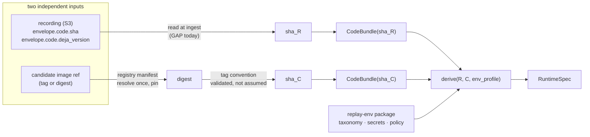
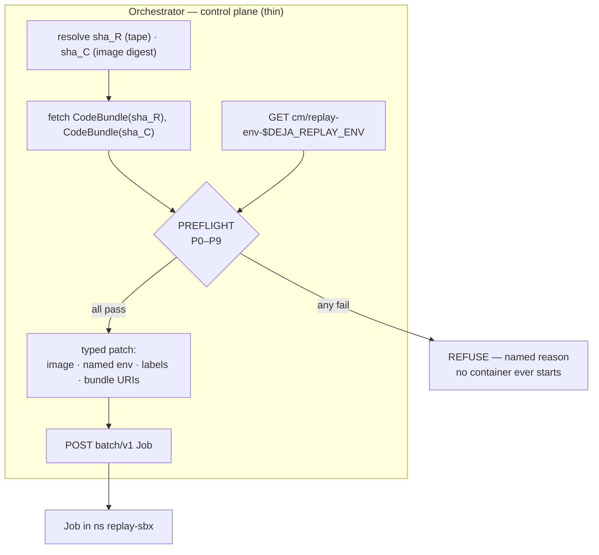
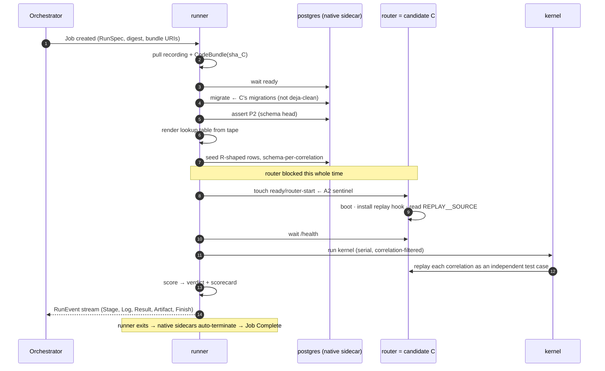

# Replay Runtime Resolution — two code refs, one derivation

**Status:** design, ratified direction. `[DECIDED]` · `[BUILT]` = exists today ·
`[GAP]` = must be written.

## The question

> *"A recording's manifest would tell it was of a certain tag/code ref, and the replay —
> the candidate — is another. The code ref is what determines the pre-replay
> prerequisites: creating the k8s Job, seeding, then letting the kernel hit and observe.
> I don't want to keep making changes to make it work, just so it fails again."*

A replay run is a function of **two code refs**, not one:

| | symbol | where it comes from | what it determines |
|---|---|---|---|
| the recording | `R` | the tape's own envelope | how the seed data is *shaped*, what crypto/store contract produced it |
| the candidate | `C` | the image ref under test | what schema the router *reads*, what deja wire it speaks |

The whole premise of cross-version replay is that **`R ≠ C`**. Everything that has bitten
us — the 35-migration gap, the crypto epoch, the seed-key join — is a property of the
*pair*, not of either ref alone. Treating the candidate as the only input is what makes
each new failure look novel.

Genericity comes from three properties, and only the third stops the loop:

1. **One index.** Every code-derived input resolves from a sha.
2. **One derivation.** `RuntimeSpec = derive(R, C, env_profile)`. Nothing hand-wired.
3. **Fail-closed preflight.** Every past failure becomes a *named assertion* that refuses
   to start. A harness bug that yields a wrong *verdict* teaches nothing — it looks like a
   candidate regression. A harness bug that refuses to run, naming its reason, is fixed once.

---

## What each ref can tell us

### The recording already declares itself `[BUILT, verified]`

Every envelope the router emits carries, alongside the event:

```rust
// crates/router/src/services/kafka/deja_record_sink.rs:211-214
code: Code {
    sha: self.code_sha.as_deref(),
    deja_version: deja::PKG_VERSION,
},
capture: Capture { mode: "session", session_id: &self.recording_run_id },
```

So `R` is in the tape: **`code.sha`** and **`code.deja_version`**, on every event.

Two caveats, both real:

- **The orchestrator throws it away.** `CaptureProbe` (`s3/mod.rs:64`) parses only
  `session_id`; the compactor unwraps `event` and drops `code` and `capture` entirely.
  The information exists on the wire and is discarded at ingest. `[GAP]`
- **`code.sha` may be `"unknown"`.** `resolved_code_sha` (`deja_boot.rs:66`) tries, in
  order: configured `identity.code_sha` → the env var named by `identity.git_sha_env`
  (default `VERGEN_GIT_SHA`) → the compile-time `option_env!("VERGEN_GIT_SHA")` → the
  literal `"unknown"`. Sandbox configures **no identity block**, so today the tape's sha
  depends entirely on whether the Jenkins build stamped vergen. **Unverified.**
  *Fix, one line of infra:* set `ROUTER__DEJA__IDENTITY__CODE_SHA` to the deployed
  `imageTag`. Then the tape's ref is a deployment fact, not a build accident.

### The candidate cannot declare itself `[BUILT, verified]`

The frozen router image's final stage copies exactly two artefacts:

```
COPY --from=builder /router/config/payment_required_fields_v2.toml  ${CONFIG_DIR}/...
COPY --from=builder /router/target/release/${BINARY}                ${BIN_DIR}/${BINARY}
```

`grep -ci 'migrations|diesel' Dockerfile` → **0**. No migrations, no diesel, no
`docker_compose.toml`. And `code_sha` is *configured*, not stamped — the running router
cannot be trusted to report its own identity.

But **the tag is the commit**: the ArgoCD pin `imageTag: ff191d7f79` equals
`git rev-parse --short=10 deja-pr`, and Jenkins tags every `deja-pr-patch-*` branch the
same way. So `C` resolves through **git**, not through the image layers.

---

## One resolver, used twice



### CodeBundle `[GAP]`

The *same* artifact for both refs. Built once per sha, by CI or a `deja-bundle`
subcommand, from `vendor/hyperswitch @ <sha>` — never from `hyperswitch-deja-clean`:

```
s3://…/code/<sha>/bundle.tar.zst     migrations/ , config/
s3://…/code/<sha>/fingerprints.json  schema_head, deja_rev, redis_key_prefix,
                                     config_sha256, crypto_epoch
```

This is the generic fix for **A1**. The runner image stops bundling migrations at all;
migrations arrive keyed by the sha that needs them. A candidate whose schema moved forward
carries its own schema forward. Nothing to remember, nothing to sync.

If no bundle exists for a resolved sha, the run **refuses**. There is no guessing fallback.
S3 is reachable from the pod (VPC gateway endpoint); git is not, and must not be — the
replay pod is egress-sealed.

---

## The derivation — what the pair `(R, C)` decides

| prerequisite | derived from | why |
|---|---|---|
| migrations to apply | **`C`** | the router reads with the *candidate's* diesel models |
| seed row shape | **`R`** | the tape's rows were written by the *recording's* schema |
| schema skew | `diff(R.schema_head, C.schema_head)` | this **is** cross-version replay; must be tolerated, not stumbled into |
| pg / redis sidecar versions | **`R`** | the store contract that produced the tape |
| redis key prefix | **`R`** | the seeder writes `{corr}:{recorded_physical}` |
| crypto epoch | **`R`** | seeded ciphertext decrypts only under the recording's keys |
| deja wire / boundary identity | `R.deja_version` vs `C.deja_rev` | a changed lookup identity breaks the join silently |
| kernel drive set | run params | correlation filter |

**The skew is the point, and it is also the danger.** The seeder writes recorded columns
verbatim. If `C` added a `NOT NULL` column without a default, the insert fails; if `C`
added a nullable column, the row seeds fine and the candidate sees `NULL` where production
would see a value. The first is loud. The second is a *silent* behavioural difference that
scores as a divergence. `[GAP]` — the seeder must diff the two schemas and either fill or
refuse, explicitly.

---

## The preflight gate — where every past bug goes to die `[GAP]`

Each row is a bug we have already hit. Unasserted, each produces a **plausible false
divergence** rather than an error. That is the failure mode worth engineering against.

| # | Assertion | Guards | Symptom if unasserted |
|---|---|---|---|
| P0 | `R.code.sha != "unknown"` | anonymous tape | cannot derive anything; silently proceeds on defaults |
| P1 | `CodeBundle` exists for `sha_R` **and** `sha_C` | A1 | runner migrates the wrong schema |
| P2 | applied `__diesel_schema_migrations` head == `C.schema_head` | A1 | router 500s → scored as body divergence |
| P3 | `R.crypto_epoch == env.crypto_epoch` | A5 | garbage decrypt → connector-body divergence |
| P4 | `R.deja_version` join-compatible with `C.deja_rev` | A6 | 100% seed miss, green-looking pipeline |
| P5 | `R.redis_key_prefix == C.redis_key_prefix` | seed join | seed miss → NotFound → divergence |
| P6 | schema skew `R→C` has no unfilled `NOT NULL` additions | skew | insert failure, or silent NULL semantics |
| P7 | every env key classified `keep`/`replace`/`forbid` | env drift | sandbox config silently inherited |
| P8 | egress NetworkPolicy **enforced** (probe, not declared) | live call | replay charges a real card |
| P9 | `HARNESS_STATE_DIR` == root of router's `REPLAY__SOURCE` | A3 | replay silently degrades to live traffic |

P2 runs *inside* the Job (it needs a live database). The rest run in the orchestrator before
the Job is created — a refusal costs nothing.

**P8 deserves emphasis.** On the AWS VPC CNI a NetworkPolicy is *silently ignored* unless
the network-policy controller is enabled. Declaring the policy is not evidence it works.
The assertion must be a probe that proves egress is actually denied.

---

## Composition and runtime





The sentinel at step 9 is the only reason the router does not boot against an unmigrated,
unseeded store. It is mandated by the boot contract and **written nowhere** today — that is
`A2`, and it is why the router currently just crash-loops until the lookup file appears,
which happens *before* migrate and seed.

---

## Why this is generic

- **A new candidate** (any `deja-pr-patch-*`, any future branch) needs no orchestrator
  change: build it, bundle it by sha, pass the ref. Migrations and config travel with it.
- **A new recording** from a different deployment carries its own `code.sha`; the pair
  re-derives. No "which schema was this again?"
- **A new environment** (`prod-mirror`) is a new `replay-env` package. No code change.
- **A new sandbox config knob** fails P7 rather than being silently inherited.
- **Version skew** is a first-class input, asserted at P6, not a surprise at scoring time.

The orchestrator's total knowledge of Hyperswitch shrinks to: *resolve two refs, fetch two
bundles, patch a template, poll a Job, render a report.*

## Gaps this design does **not** close

- **A4 (redis ambient correlation)** is vendor code (`redis_interface::add_prefix`). No
  amount of runtime resolution fixes it; it needs a vendor change and a rebuild of all seven
  candidate images.
- **P3 needs a crypto epoch to exist.** Nothing stamps one. Recording must emit a keyed
  digest of `master_enc_key`/`hash_key` — never the key — for the assertion to compare.
- **P0 needs the recording env to declare its ref.** One infra line today
  (`ROUTER__DEJA__IDENTITY__CODE_SHA = imageTag`); without it we are betting on vergen.
- **Ingest must stop discarding the envelope.** `code` and `capture` are on the wire and
  dropped at `CaptureProbe`.
